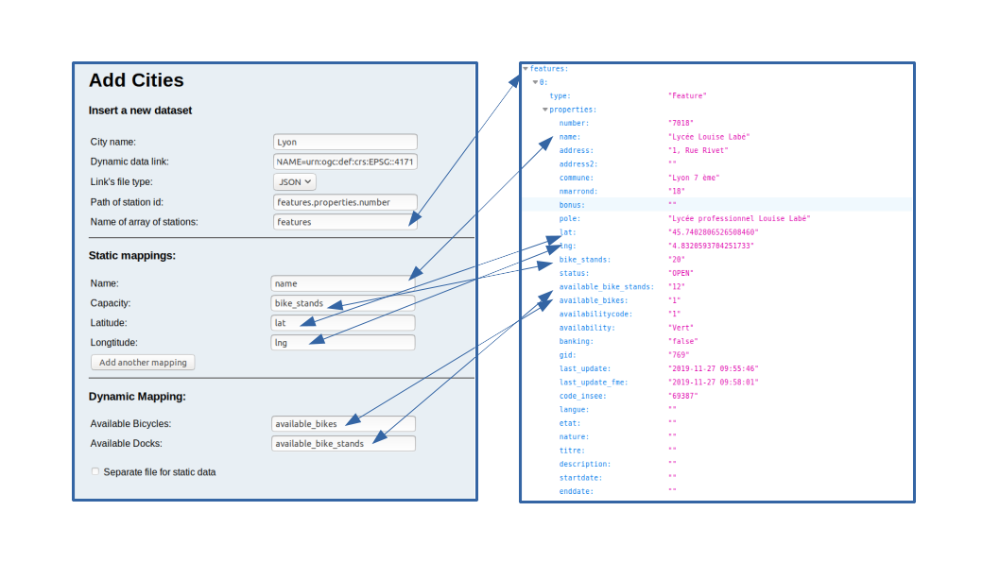

# Requirements to be Installed
A server with the following requirements:
* PHP
* Apache Jena Fuseki triple store 
* Linux operating system

A client with the following requirements:
* A web browser

> **Note:** The server can be replaced by the localhost, but this requires the installation of Apache server.  
  
> **Note:** Create new dataset called "test".


## Linux "Permission Denied"
The server should be running a Linux operating system, therefore sometimes writing in a file in Linux (from a java program) in some special directories requires permission. In our case, we wanted to write the RDF data transformed from JSON, XML, or CSV to a new text file that is found on the local host (/var/www). But we faced a problem because of sudo permissions in Linux. So, in order to solve this problem, some commands should be launched in the server:
```
sudo adduser <username> www-data
sudo chown -R www-data:www-data /var/www
sudo chmod -R g+rw /var/www
```

# Add a City to the Database
In order to add a new city to our website through the html page **blog.html**, the following fields are filled:
1. City name: The name of the city (Paris, Lyon, Saint Etienne, ...)
2. Dynamic data link: A url where the data can be downloaded from
3. Link's file type: JSON, XML, or CSV
4. Path of station id: The path, from the root to the id key, separated by the **dot** character '**.**' 
5. Path of array of stations: The path, from the root to the name of the array of stations, separated by the **dot** character '**.**' 
> **Note:** In the case of CSV file, the 4th and the 5th points are unconsidered (path of station id and path of array of stations).

For the remaining fields, each field should contain the key word that provides its information as follows:
* In JSON files: The key word is the key.
* In XML files: The key word is either an attribute or a XML tag.
* In CSV files: The key word is the column name.



The user can add additional information about a station, by pressing the button **Add mapping**. The additional information can be:
* Capacity
* Address
* Last update
* Bank card

When the user finishes filling the form, he presses the **"Send information"** button.

# Stations of the Added cities

To visualize the station of the added cities, the user should go to the tab named **Map**. There, a map will open and the user can choose a city and see all the added stations. When clicking on a marker, the map shows the corresponding information.
Another form of visualizing the data, is the card view. The user can click the button **SHOW LIST**, in order to see the stations listed in a card view.

# Statistics
To see how did the number of available bicycles and available docks change in a specific station, the user can click on the tab named **Statistics**. 
The user chooses a city, station, and an end date in order to view the variation of the values from the chosen specific time to the current time. 

## Dynamic Run
In order to ensure that our triple store is updated every specific time t, we should run the Linux script called "run_in_background.sh" found on the server, that takes as a parameter the number of minutes it should wait between the addition of every update:
```
./run_in_background {t}
```
This will let the java tool collect all the cities found in our triple store, and for each city, add its new dynamic configuration with the corresponding time.
